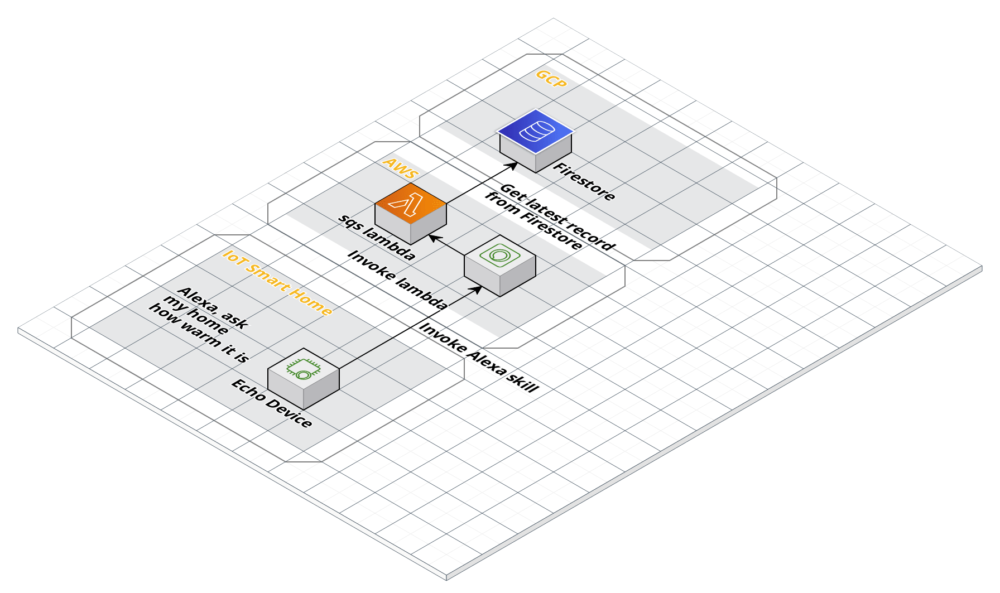

[](http://www.apache.org/licenses/LICENSE-2.0.html)

# homely-teller

## Basic usage

```text
    Alexa, ask my home how warm it is

    Currently the temperature is 16 degrees and 60 percent humid in your home
```

## Architecture



### License
This code is open source software licensed under the [Apache 2.0 License]("http://www.apache.org/licenses/LICENSE-2.0.html")